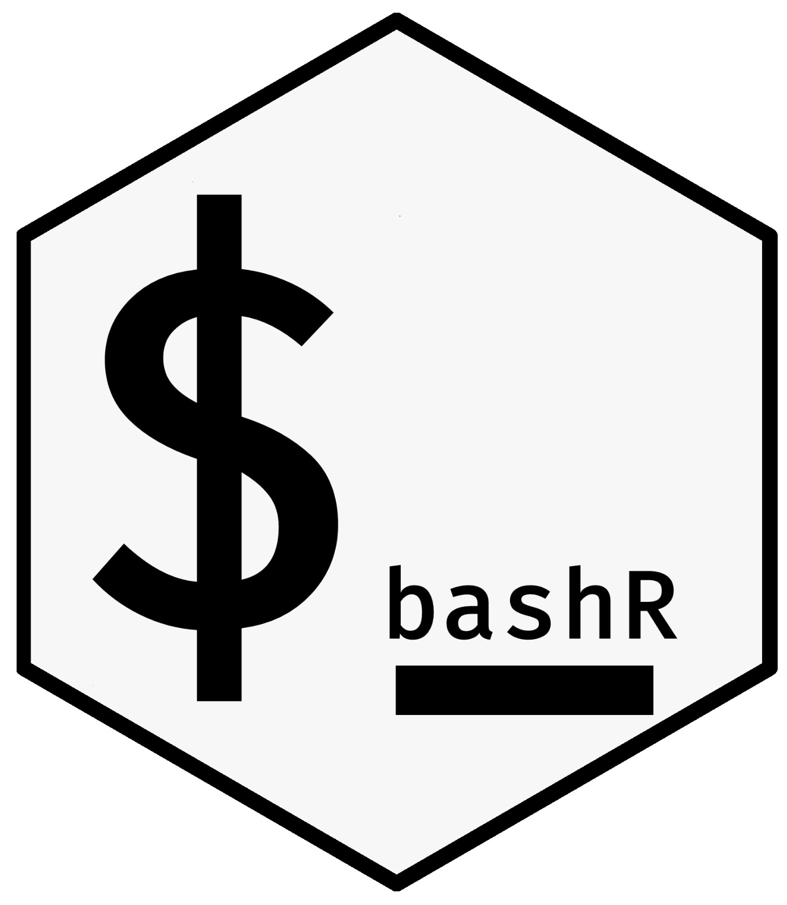

<!-- README.md is generated from README.Rmd. Please edit that file -->
# bashr 


```{r, include = FALSE}
knitr::opts_chunk$set(
  collapse = TRUE,
  # eval = F,
  comment = "#>",
  fig.path = "man/figures/README-",
  out.width = "100%"
)

```

```{r, echo = FALSE, results='asis', eval = T}

library(badger)

git_repo <- "benjaminguinaudeau/bashR"

cat(
  badge_lifecycle(),
	badge_code_size(git_repo),
	badge_last_commit(git_repo)
)
```

Some usefull functions to execute some bash code in R


## Thanks

A huge thank you to [Favstats](https://github.com/favstats) for designing the hex-sticker. 
