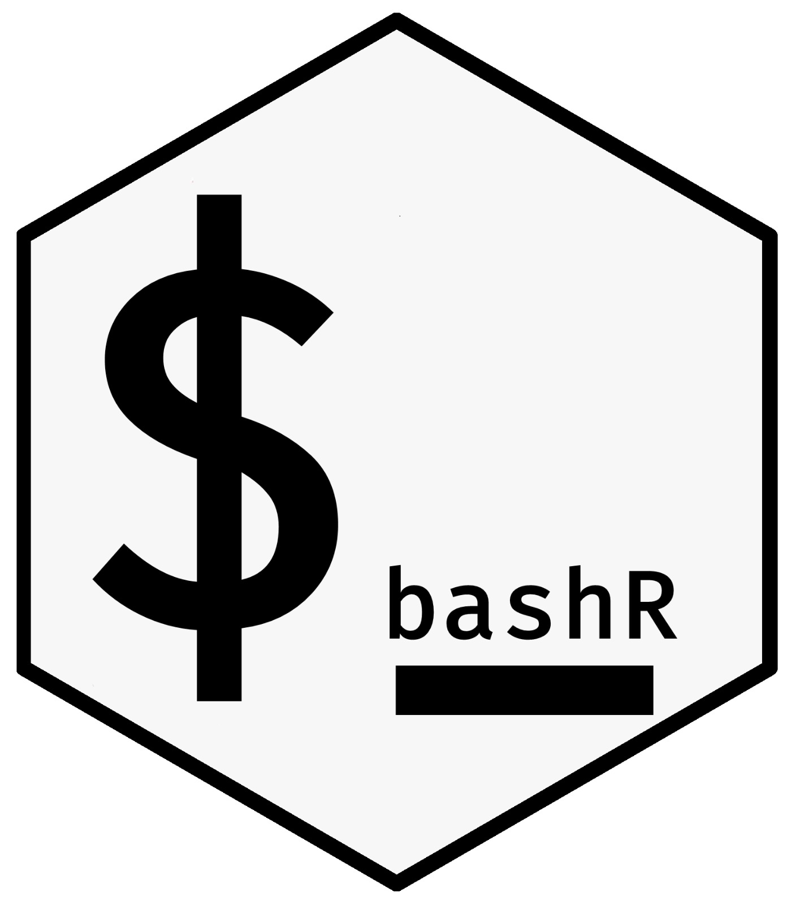

<!-- README.md is generated from README.Rmd. Please edit that file -->

# bashr 

Some usefull functions to execute some bash code in R

## Thanks

A huge thank you to [Favstats](https://github.com/favstats) for
designing the hex-sticker.
